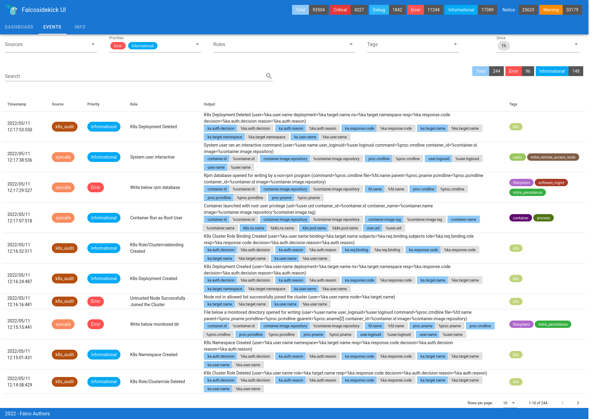

# Falcosidekick-ui

[](https://github.com/falcosecurity/evolution/blob/main/REPOSITORIES.md#ecosystem-scope) [](https://github.com/falcosecurity/evolution/blob/main/REPOSITORIES.md#incubating)


    [](https://circleci.com/gh/falcosecurity/falcosidekick-ui)

## Description

A simple WebUI for displaying latest events from [Falco](https://falco.org). It works as output for [Falcosidekick](https://github.com/falcosecurity/falcosidekick).

## Requirements

Events are stored in a `Redis` server with [`Redisearch`](https://github.com/RediSearch/RediSearch) module (> v2).

## Usage

### Options
#### Precedence: flag value -> environment variable value -> default value

```shell
Usage of Falcosidekick-UI:  
-a string
      Listen Address (default "0.0.0.0", environment "FALCOSIDEKICK_UI_ADDR")
-d boolean
      Disable authentication (environment "FALCOSIDEKICK_UI_DISABLEAUTH")
-l string   
          Log level: "debug", "info", "warning", "error" (default "info",  environment "FALCOSIDEKICK_UI_LOGLEVEL")
-p int
      Listen Port (default "2802", environment "FALCOSIDEKICK_UI_PORT")
-r string
      Redis server address (default "localhost:6379", environment "FALCOSIDEKICK_UI_REDIS_URL")
-t int
      TTL for keys (default "0", environment "FALCOSIDEKICK_UI_TTL")
-u string  
      User in format <login>:<password> (default "admin:admin", environment "FALCOSIDEKICK_UI_USER")
-x boolean
      Allow CORS for development (environment "FALCOSIDEKICK_UI_DEV")
```

> If not user is set and the authentication is not disabled, the default user is `admin:admin`

### Run with docker

```shell
docker run -d -p 2802:2802 falcosecurity/falcosidekick-ui
```

### Run

```
git clone https://github.com/falcosecurity/falcosidekick-ui.git
cd falcosidekick-ui

go run .
#or
make falcosidekick-ui && ./falcosidekick-ui
```

### Endpoints

| Route   | Method | Query Parameters | Usage            |
| :------ | :----: | :--------------- | :--------------- |
| `/docs` | `GET`  | none             | Get Swagger Docs |
| `/`     | `GET`  | none             | Display WebUI    |

#### UI

The UI is reachable by default at `http://localhost:2802/`.

#### API

> The prefix for access to the API is `/api/v1/`.
> The base URL for the API is `http://localhost:2802/api/v1/`.

| Route                       | Method | Query Parameters                                                         | Usage                                |
| :-------------------------- | :----: | :----------------------------------------------------------------------- | :----------------------------------- |
| `/`                         | `POST` | none                                                                     | Add event                            |
| `/healthz`                  | `GET`  | none                                                                     | Healthcheck                          |
| `/authenticate`, `/auth`    | `POST` | none                                                                     | Authenticate                         |
| `/configuration`, `/config` | `GET`  | none                                                                     | Get Configuration                    |
| `/outputs`                  | `GET`  | none                                                                     | Get list of Outputs of Falcosidekick |
| `/event/count`              | `GET`  | `pretty`, `priority`, `rule`, `filter`, `tags`, `since`, `limit`, `page` | Count all events                     |
| `/event/count/priority`     | `GET`  | `pretty`, `priority`, `rule`, `filter`, `tags`, `since`, `limit`, `page` | Count events by priority             |
| `/event/count/rule`         | `GET`  | `pretty`, `priority`, `rule`, `filter`, `tags`, `since`, `limit`, `page` | Count events by rule                 |
| `/event/count/source`       | `GET`  | `pretty`, `priority`, `rule`, `filter`, `tags`, `since`, `limit`, `page` | Count events by source               |
| `/event/count/tags`         | `GET`  | `pretty`, `priority`, `rule`, `filter`, `tags`, `since`, `limit`, `page` | Count events by tags                 |
| `/event/search`             | `GET`  | `pretty`, `priority`, `rule`, `filter`, `tags`, `since`, `limit`, `page` | Search events                        |

All responses are in JSON format.

Query parameters list:
* `pretty`: return well formated JSON
* `priority`: filter by priority
* `rule`: filter by rule
* `filter`: filter by term
* `source`: filter by source
* `tags`: filter by tags
* `since`: filter by since (in 'second', 'min', 'day', 'week', 'month', 'year')
* `limit`: limit number of results (default: 100)
* `page`: page of results

## Development

### Start local redis server

```shell
docker run -d -p 6379:6379 redislabs/redisearch:2.2.4
```

### Build

Requirements:
* `go` >= 1.18
* `nodejs` >= v14
* `yarn` >= 1.22

```shell
make falcosidekick-ui
```

### Lint

```shell
make lint
```

### Full lint

```shell
make lint-full
```

### Update Docs

Requirement:
* [`swag`](https://github.com/swaggo/swag)

```shell
make docs
```

## Screenshots





## Authors

* Thomas Labarussias (https://github.com/Issif)
* Frank Jogeleit (https://github.com/fjogeleit)
